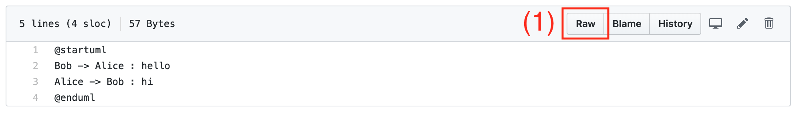
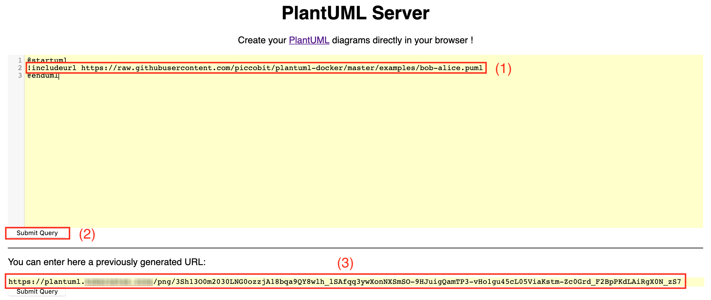

# plantuml-docker

Heavily inspired by the [original Docker image](https://github.com/plantuml/plantuml-server), this Docker image will run a plantUML server for you.

## How to build

    docker build --tag plantuml-server .

## How to run

    docker run -d -p 8080:8080 plantuml-server
    
The plantuml-server is now listening on port 8080 and available using the following URL:

    http://localhost:8080/
    
## How to configure

Setting the environment variable `JETTY_CONTEXTPATH` allows you to add a prefix to the URL.

### Example

    docker run -d -p 8080:8080 -e JETTY_CONTEXTPATH=/plantuml plantuml-server

The plantuml-server is now listening on port 8080 and available using the following URL:

    http://localhost:8080/plantuml

## How to use

The [plantuml-server description](http://plantuml.com/de/server) provides a detailled explanation how to use the plantuml-server.

## How to serve plantuml images for GitHub

The [examples](examples) folder contains an example showing you how to use the plantUML-server to provide images for your GitHub Markdown files.

First get the raw URL of your plantUML file:

Go to your plantUML server, modify the below shown plantUML diagram with the raw URL of your plantUML file on GitHub:

Press the button below the input field and finally copy the generated plantUML server URL. This URL just points the plantURL server back to your plantUML file on GitHub and doesn't change as long as you don't change the name or location of the file.

Insert this plantUML server URL into your Markdown file:

Replacing the `png` part in your plantUML server URL with `svg` renders your graph as SVG, but to get this also working on GitHub you have to sanitize the SVG first using the GitHub sanitizer by adding `&sanizize=1` do your SVG URL.
